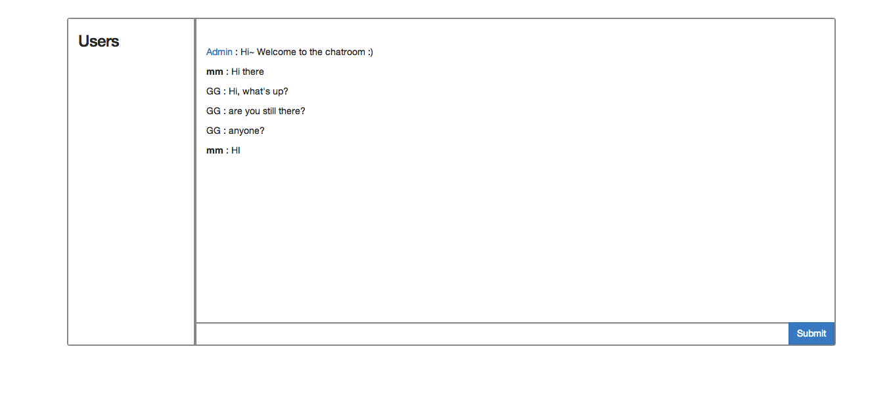

# Chatroom
Simple chatroom App built with AngularJS, ExpressJS, Socket.io


## Prerequisits
- [Node.js and NPM](http://nodejs.org/)
<!-- - [MongoDB](http://www.mongodb.org/) -->
- [CoffeeScript](http://coffeescript.org/)
- [Yeoman](http://yeoman.io/) ( Including Yo, [Bower](http://bower.io/), [Grunt](http://gruntjs.com/) )

## Preprocessor
- Less for CSS
- CoffeeScript for JS

## How to run it?
1 Enter file directory

```
$ cd App-chatroom
```

2 Install front-end packages with Bower

```
$ bower install
```
3 Install develop and back-end packages with NPM

```
$ npm install
```

4 Run mongoDB in new tab (functionality not built yet)

```
$ mongod
```

5 Run App with Node

```
$ node app.js
```

6 You can run and develop with command
```
$ grunt server
```

## Where I learned these?
- CodeSchool - Real-time Web with Node.js - 6 Socket.io